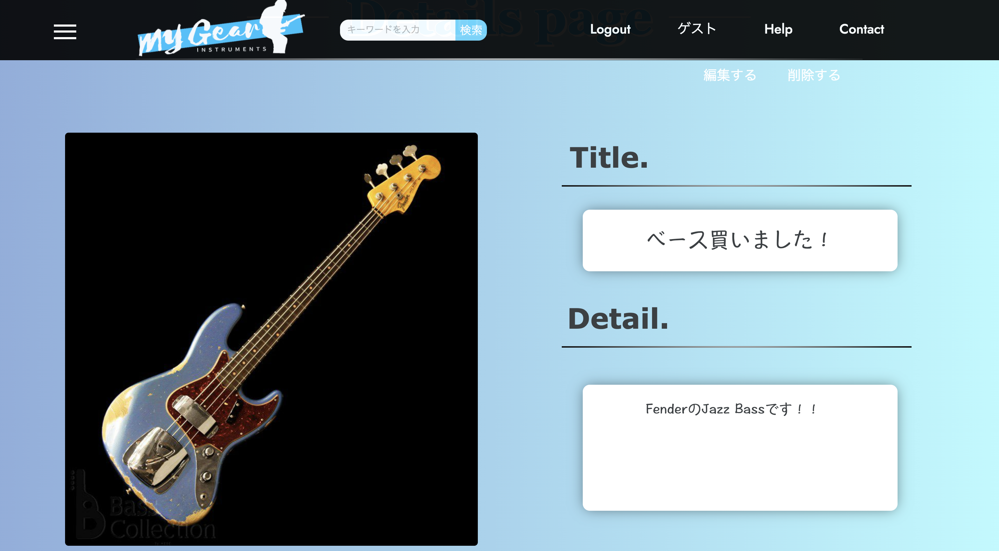

# My Gear
**リンク:** http://3.227.84.138/

# 概要
**今まで知らなかった楽器プレイヤーと知り合って、交流を図りたい**という思いで制作しました。

自分の楽器、新しく購入した写真を共有したり、所有している機材を整理して今何を持っているかまとめておくことができます。

楽器を始めた方から、ミュージシャンまで、誰とでも知り合うことができる楽器写真共有アプリケーションです。

# 制作背景
現在あるSNSで演奏者の発信を見ると、ライブ、新曲のお知らせ、演奏動画など様々な投稿がありました。中でも新しい楽器、機材を入手した時に「My New Gear!」と投稿されているのをよく見かけていて、たくさんのいいねが押されているものもありました。

それまでSNSでは自分や誰かがフォローしていたり、いいね等で広まったものの投稿を見て今まで知らなかった人をフォローしたり、いいねしたりという形でした。

音楽を楽しんでいる人同士がもっと知り合えることはできないか？と課題を考えた時に、演奏動画や、作成した曲のお知らせよりもハードルが低い、My楽器の写真を投稿して共有し、そこから繋がっていけるようなアプリケーションがあれば良いのではないか、そう思い作成しました。

楽器を始めた方から、ミュージシャンまで、  
新しく入手したもの、今所有しているもの関係なく投稿し、  
誰とでも知り合うことができる楽器写真共有アプリケーション  
**「My Gear」**  
よろしくお願いします。

# 工夫した点
・初めて利用した方にもすぐに使い方がわかるようにシンプルな見た目にしました。  

・特定の楽器を閲覧したい場合、わかりやすく楽器ごとのカテゴリー分けをしました。  

・ユーザー目線で考えた時、制約が多いとストレスをかける可能性があるため、最低限のバリデーションにしました。  

# 使用した技術
## フロントエンド
HTML / CSS / JavaScript / jQuery
## バックエンド
Ruby / Ruby on Rails / RuboCop
## データベース
MySQL / Sequel Pro
## インフラ
AWS(EC2) , Capistrano
## Webサーバ
Nginx
## アプリケーションサーバ
Unicorn
## ソース管理
GitHub / GitHubDesktop
## テスト
RSpec
## エディタ
VSCode

# 機能一覧
・ユーザー登録、ログイン機能  
・ユーザー編集機能  
・ゲストログイン機能  
・投稿検索機能  
・楽器写真投稿機能  
・ページトップボタン  
・画像プレビュー機能  
・投稿編集機能  
・投稿削除機能  
・コメント機能  
・ハンバーガーメニュー  
・楽器ごとのカテゴリー分け  

# 今後実装予定の機能
・コンタクトフォーム  
・ヘルプページ  
・エラーハンドリング  
・複数画像投稿  
・インクリメンタルサーチ(Ajax)  
・文字数カウント(Ajax)  
・フォロー機能  
・フォロー通知  
・いいね機能  
・いいね通知  
・コメント(Ajax)  
・コメント数表示機能  
・ページネーション  
・チャット機能  
・ユーザーごとのアバター表示  
・レスポンシブ対応  

# DB 設計

## usersテーブル

| Column       | Type   | Options                   |
| ------------ | ------ | ------------------------- |
| email        | string | null: false, unique: true |
| password     | string | null: false               |
| name         | string | null: false               |
| profile      | text   | null: false               |

### Association
- has_many :posts
- has_many :comments

## postsテーブル

| Column       | Type       | Options           |
| ------------ | ---------- | ----------------- |
| title        | string     |                   |
| summary      | text       |                   |
| category_id  | integer    | null: false       |
| user         | references | foreign_key: true |

### Association
- belongs_to :user
- has_many :comments

## commentsテーブル

| Column    | Type       | Options           |
| --------- | ---------- | ----------------- |
| text      | text       | null: false       |
| user      | references | foreign_key: true |
| prototype | references | foreign_key: true |

### Association
- belongs_to :user
- belongs_to :post
